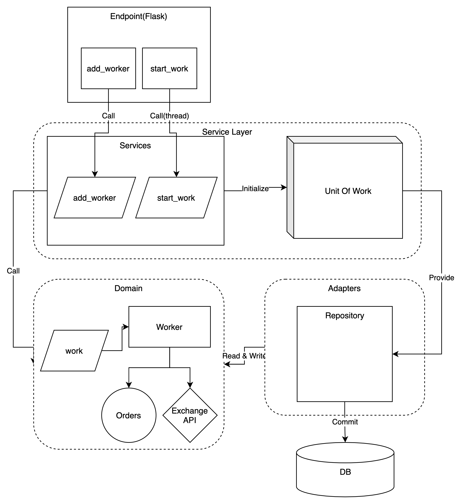

# Crypto Currency Automatic Trading System(C-ATS)
암호화폐 자동매매 시스템의 샘플 구현 입니다.
실제 구현과는 차이가 있으며, 어떻게 구현되었는지 참고할 수 있습니다.
Python 기반의 Flask와 SqlAlchemy 를 사용하여 구현 하였습니다.(실제 운영 중인 시스템에서는 Django 기반으로 운영하고 있습니다.)
프로젝트의 전체적인 구조는 [Cosmic Python](https://www.cosmicpython.com/book/preface.html) 을 참고하였습니다.

이 레포지토리의 코드는 샘플 코드이며, 실제 잘 동작하는지 확인을 하지는 않았습니다.
운영중인 시스템에서는 꾸준히 수익을 발생시키고 있으며, 자세한 구현 사항은 코드와 아래 다이어그램을 참고하여 주세요.


# Component Diagram

자동매매를 하려는 암호화폐 시장의 worker 를 add_worker 엔드포인트로 추가후,
start_work를 하면 background thread 가 돌며 쉬지 않고 시장 상황을 모니터링하며 거래 합니다.
이때 거래소 API를 활용하게 됩니다.

실제 자동매매 로직을 살펴보려면 도메인의 Worker 모델의 로직을 참고하여주세요.(실제 운영중인 시스템에서는 이와 비슷하지만 훨씬 더 복잡한 로직으로 운영중입니다.)
로직을 참고후 응용하여 자신만의 자동매매 시스템을 만들 수 있습니다.

# Requirements
- docker
- docker-compose

# Building the containers
```shell
make build
make up
```

# Creating a local virtualenv
```shell
python3.8 -m venv .venv && source .venv/bin/activate # or however you like to create virtualenvs

make install
```

# Running the tests
```shell
make test
```